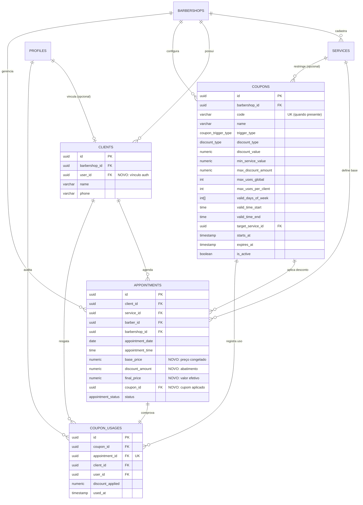

# Release Notes: Módulo de Cupons, Promoções Inteligentes e Auditoria Financeira

**Versão da Release:** `v1.2.0-db-promotions`  
**Data:** 07 de Setembro de 2026  
**Ambiente:** Banco de Dados PostgreSQL (Supabase)  
**Scripts Associados:**
* [`scripts/013_coupons_and_promotions.sql`](file:///scripts/013_coupons_and_promotions.sql) *(DDL Principal, Triggers, Views e RLS)*
* [`scripts/014_seed_promotions.sql`](file:///scripts/014_seed_promotions.sql) *(Massa de Dados e Exemplos de Teste)*

---

## 1. Sumário Executivo

Esta atualização estende o modelo relacional do sistema de barbearias para suportar **campanhas promocionais, cupons com código e promoções automatizadas baseadas em comportamento de agendamento** (*Yield Management* e retenção de clientes em risco de *churn*).

Além das novas entidades de promoção, a release soluciona uma deficiência contábil do modelo anterior: o **congelamento do preço e desconto na data do agendamento**, garantindo que relatórios financeiros históricos permaneçam imutáveis mesmo após eventuais reajustes na tabela de serviços.

---

## 2. Diagrama Entidade-Relacionamento (ERD)

O diagrama abaixo ilustra as tabelas impactadas e criadas nesta release, destacando o fluxo entre serviços, agendamentos, cupons e histórico de utilizações:

---

## 3. Detalhamento Técnico das Modificações

### 3.1 Novos Tipos Enumerados (Enums)
* `discount_type`:
  * `'percentage'`: Desconto proporcional em porcentagem (ex: 15%).
  * `'fixed'`: Abatimento em valor nominal em Reais (ex: R$ 10,00).
* `coupon_trigger_type`:
  * `'manual_code'`: Cupom convencional inserido manualmente pelo cliente via código.
  * `'off_peak'`: Promoção automática ativada para dias/horários de baixa ocupação (*Happy Hour*).
  * `'loyalty'`: Promoção por assiduidade/frequência de cortes.
  * `'retention'`: Promoção focada em reativação de clientes inativos (*prevenção de churn*).

---

### 3.2 Novas Tabelas

#### A. `coupons`
Armazena a definição da promoção, seu modelo matemático de desconto e suas restrições operacionais.
* **Chave Primária:** `id` (UUID).
* **Multi-tenant:** `barbershop_id` (UUID FK para `barbershops`).
* **Código Promocional:** `code` (VARCHAR), único por barbearia via índice parcial (`WHERE code IS NOT NULL`). Permite valores nulos para regras automáticas.
* **Regras de Agenda / Yield:**
  * `valid_days_of_week` (`INT[]`): Vetor de dias válidos (0=Domingo, 1=Segunda, ..., 6=Sábado).
  * `valid_time_start` e `valid_time_end` (`TIME`): Janela de horário elegível ao desconto.
* **Limites:** `max_uses_global`, `max_uses_per_client`, `min_service_value` e `max_discount_amount`.

#### B. `coupon_usages`
Tabela de auditoria e controle de exaustão de promoções.
* Garante a restrição de uso único por agendamento (`UNIQUE (appointment_id)`).
* Registra o valor financeiro exato abatido na transação (`discount_applied`).
* Permite consulta rápida da quantidade de usos por cliente ou usuário autenticado (`user_id`, `client_id`).

---

### 3.3 Alterações em Tabelas Existentes

#### Tabela `appointments`:
* Inclusão de `base_price` (NUMERIC): Preço de tabela do serviço no instante da contratação.
* Inclusão de `discount_amount` (NUMERIC): Montante abatido pela promoção (default `0.00`).
* Inclusão de `final_price` (NUMERIC): Valor final a ser faturado (`base_price - discount_amount`).
* Inclusão de `coupon_id` (UUID FK): Referência opcional à promoção que originou o desconto.

#### Tabela `clients`:
* Inclusão de `user_id` (UUID FK para `profiles(id)`): Criação de ponte opcional com a identidade de autenticação, facilitando validações de cupom por conta de usuário.

---

### 3.4 Triggers e Compatibilidade com Legado

* **Trigger `trg_set_appointment_pricing`:**  
  Executada `BEFORE INSERT OR UPDATE` na tabela `appointments`. Se o payload recebido do frontend ou backend não informar `base_price` ou `final_price`, a trigger consulta automaticamente o valor vigente na tabela `services` e preenche as colunas.
  > **Benefício:** Zero quebra de código. Chamadas legadas continuam funcionando sem necessidade de alteração simultânea no frontend.
* **Backfill Automático:**  
  Execução de comando `UPDATE` retroativo para alimentar `base_price` e `final_price` de todos os agendamentos previamente existentes no banco.

---

## 4. Views Analíticas Integradas

A release entrega 3 visões otimizadas para apoiar os algoritmos de promoção e os relatórios gerenciais:

1. **`view_client_retention_analysis`**:
   * Agrupa clientes pelo histórico de agendamentos concluídos e calcula a quantidade de dias desde a última visita (`days_since_last_visit`).
   * Classifica o cliente em: `ativo_recente` (<= 25 dias), `regular`, `em_risco` (>= 35 dias) ou `alto_risco` (>= 60 dias).
   * **Aplicação:** Identificar automaticamente o público-alvo de cupons do tipo `retention`.

2. **`view_occupancy_heatmap`**:
   * Agrupa o volume de agendamentos por barbearia, dia da semana (`day_of_week`) e faixa horária (`time_slot`).
   * **Aplicação:** Identificar horários ociosos (vales de demanda) para parametrização de promoções `off_peak`.

3. **`view_coupon_performance`**:
   * Consolida métricas de campanha: utilizações totais, montante total de desconto concedido e faturamento bruto obtido através do cupom.
   * **Aplicação:** Painel de ROI de marketing da barbearia.

---

## 5. Segurança e Políticas RLS (Row Level Security)

* **Multi-tenant e Isolamento:**  
  Apenas administradores e proprietários autorizados pela função de segurança `public.can_manage_barbershop(auth.uid(), barbershop_id)` podem criar, alterar ou remover cupons.
* **Leitura Pública Condicionada:**  
  Clientes autenticados ou anônimos só conseguem listar cupons marcados como `is_active = true` e dentro do período de vigência (`starts_at` e `expires_at`).
* **Auditoria:**  
  Clientes podem visualizar apenas os seus próprios registros em `coupon_usages`, enquanto gestores visualizam o histórico da sua barbearia.
